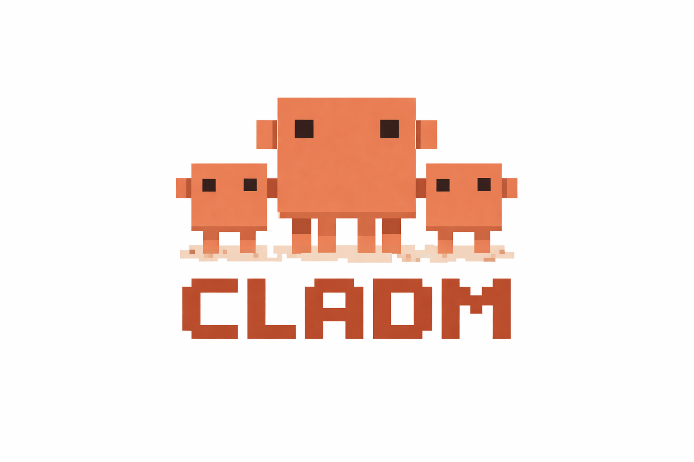
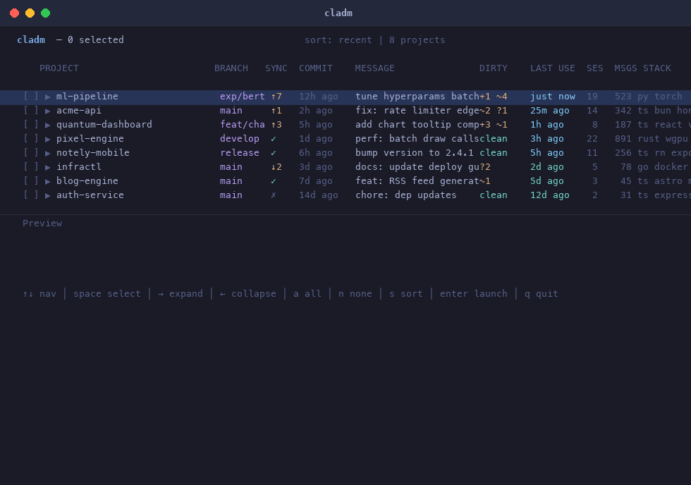
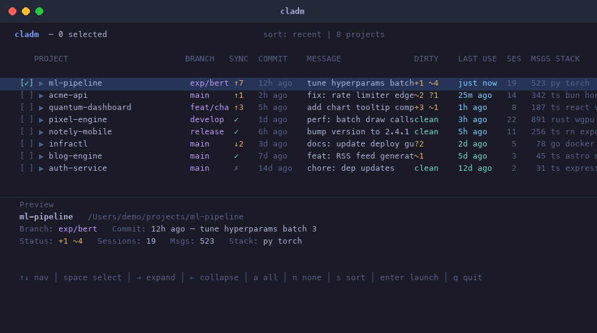
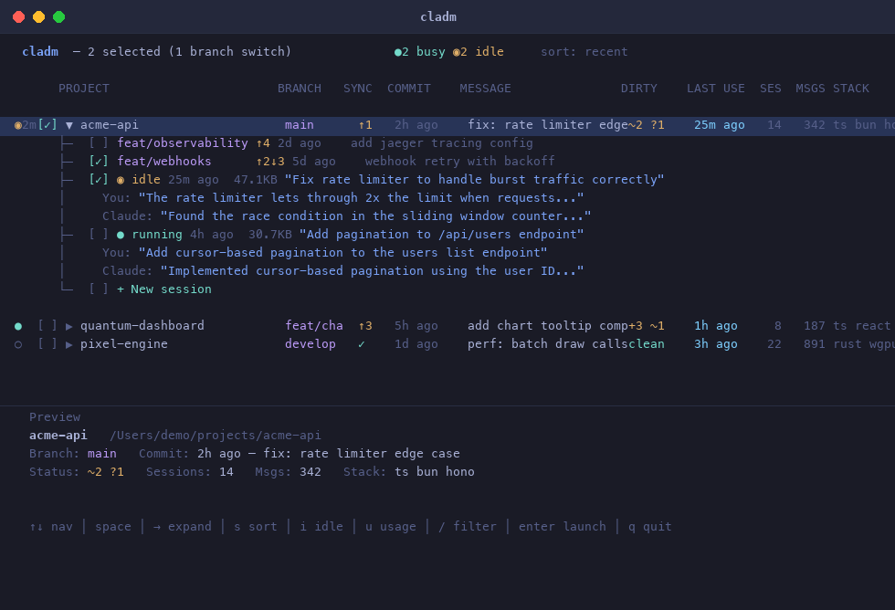
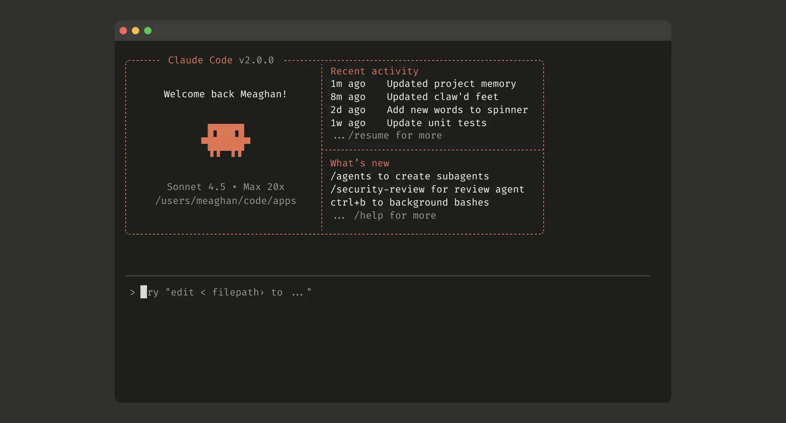

<p align="center">
  
</p>

<h3 align="center">TUI launcher for Claude Code sessions</h3>

<p align="center">
  Browse all your projects, see git status at a glance, monitor active sessions in real time, get notified when Claude finishes, and launch everything in parallel Terminal windows.
</p>

---

<p align="center">
  
</p>

## Install

Requires [Bun](https://bun.sh) >= 1.3.0 and macOS (uses Terminal.app for launching).

```bash
# Install globally
bun install -g @alezmad/cladm

# Or run directly
bunx @alezmad/cladm
```

### From source (for development)

```bash
git clone https://github.com/alezmad/cladm.git
cd cladm
bun install
bun link
```

## Usage

```bash
cladm           # launch with real project data
cladm --demo    # launch with mock data (try it out without any history)
```

## How it works

cladm reads `~/.claude/history.jsonl` to discover every project you've used with Claude Code, then enriches each one with live git metadata. The result is a fast, keyboard-driven picker that shows you everything at a glance.

## Live activity monitoring

cladm detects running Claude Code sessions and shows their real-time status:

| Indicator | Meaning |
|-----------|---------|
| `●` (green) | **Busy** — Claude is actively processing |
| `◉ 3m` (yellow) | **Idle** — Claude finished 3 min ago, waiting for input |
| `○` (dim) | No active session |

**How it works:** cladm monitors JSONL file modification times in `~/.claude/projects/`. Sessions writing within 5 seconds are considered busy; otherwise idle. The elapsed time since the last response is shown next to idle indicators.

**Sound notification:** When any session transitions from busy → idle, cladm plays a system sound (`Glass.aiff`) so you never miss a completed response — even when working across multiple projects.

## Screenshots

### Project list

The main view shows all discovered projects sorted by most recent Claude usage. Each row displays the project name, git branch, sync status, last commit, working tree state, Claude activity, session count, message count, and detected stack.

<p align="center">
  
</p>

| Column | Description |
|--------|-------------|
| **PROJECT** | Relative path from `~/Desktop` |
| **BRANCH** | Current git branch (truncated to 8 chars) |
| **SYNC** | Remote sync: `✓` synced, `↑n` ahead, `↓n` behind, `✗` no remote |
| **COMMIT** | Time since last commit |
| **MESSAGE** | Last commit message |
| **DIRTY** | Working tree: `clean`, or `+staged ~modified ?untracked` |
| **LAST USE** | Time since last Claude session |
| **SES** | Total Claude session count |
| **MSGS** | Total message count across sessions |
| **STACK** | Auto-detected stack tags (ts, py, rust, go, docker, etc.) |

### Expanded view

Press `→` on any project to expand it and see branches and individual sessions with their conversation previews.

<p align="center">
  
</p>

Each session shows:
- **Title** — auto-generated session title
- **Last prompt** — your most recent message
- **Claude's response** — the assistant's last reply
- **Size & age** — session file size and time since last use

Select a branch to launch Claude with a prompt to switch to that branch. Select individual sessions to resume them directly.

## Keybindings

| Key | Action |
|-----|--------|
| `↑` `↓` | Navigate |
| `Space` | Toggle selection |
| `→` | Expand project (branches + sessions) |
| `←` | Collapse project |
| `a` | Select all |
| `n` | Deselect all |
| `s` | Cycle sort mode (recent → name → commit → sessions) |
| `f` | Open project folder in Finder |
| `g` | Go to active session (focus Terminal) |
| `Enter` | Launch selected in Terminal.app |
| `PageUp` `PageDown` | Jump 15 rows |
| `Home` `End` | Jump to top/bottom |
| `q` `Esc` | Quit |

## What gets launched

Each selected project opens a new Terminal.app window running Claude Code:

<p align="center">
  
</p>

```bash
cd /path/to/project && claude --dangerously-skip-permissions
```

If you selected a specific session, it resumes it with `--resume <session-id>`. If you selected a non-current branch, it adds a prompt to switch branches first.

Multiple sessions in the same project open as tabs in the same window.

## Stack detection

cladm auto-detects project stacks by checking for common files:

| File | Tag |
|------|-----|
| `package.json` | `node` |
| `pyproject.toml` / `requirements.txt` | `py` |
| `Cargo.toml` | `rust` |
| `go.mod` | `go` |
| `CLAUDE.md` | `claude` |
| `Dockerfile` / `docker-compose.yml` | `docker` |

## Tech stack

- **Runtime**: [Bun](https://bun.sh)
- **UI**: [@opentui/core](https://github.com/pekochan069/opentui) (terminal UI framework)
- **Language**: TypeScript

## License

MIT
